# Архитектура сгенерированного проекта

Описание структуры и паттернов сгенерированных Go-проектов.

## Общая архитектура

Сгенерированный проект следует принципам слоистой архитектуры с чётким разделением ответственности. Зависимости направлены **только сверху вниз** — транспортный слой обращается к сервису, сервис — к данным.

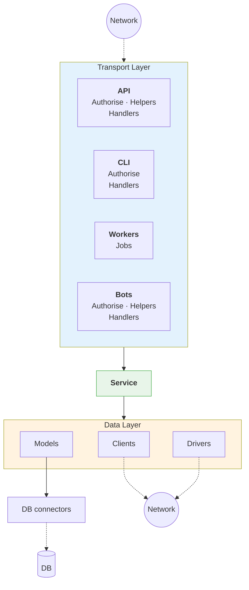

!!! note "Config (OnlineConf)"
    Конфигурация доступна на **всех слоях** — Transport, Service, Data.
    Реализована как синглтон через OnlineConf.

**Ключевые слои:**

| Слой | Компоненты | Назначение |
|------|------------|------------|
| **Transport** | API, CLI, Workers, Bots | Точки входа с Authorise, Helpers, Handlers/Jobs |
| **Service** | Бизнес-логика | Центральный компонент, единственное место для бизнес-логики |
| **Data** | Clients, Models, Drivers | Доступ к данным и внешним сервисам |
| **DB connectors** | Коннекторы к БД | Подключение к базам данных |
| **Config** | OnlineConf | Конфигурация, доступна на всех слоях |

**Внешние связи:**

- **Network** (вверху) → входящие запросы к API и Bots
- **Network** (внизу) ← исходящие запросы от Clients и Drivers
- **DB** ← запросы к базе данных через DB connectors

## Трёхслойный дизайн

Архитектура основана на трёх слоях с различными правилами зависимостей:

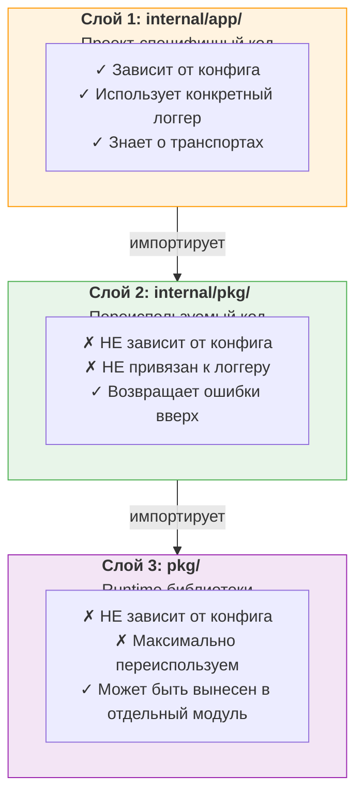

### Почему это важно?

| Проблема | Решение в архитектуре |
|----------|----------------------|
| Сложность тестирования | Нижние слои не зависят от конфига — легко мокать |
| Привязка к логгеру | `internal/pkg` возвращает ошибки, логгер — на верхнем уровне |
| Переиспользование | `pkg/` можно вынести в отдельный go module |
| Циклические зависимости | Зависимости только сверху вниз |

## Spec-First подход

Одна из ключевых особенностей сгенерированного приложения — подход **spec-first** (или contract-first):

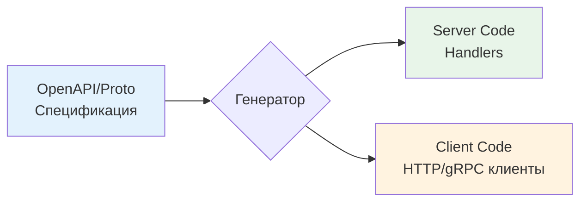

**Принцип:** Спецификация создаётся **до** написания любого кода. По этой спецификации генерируется:

- **Серверный код** — handlers для вашего сервиса
- **Клиентский код** — типизированные клиенты для вызова других сервисов

**Преимущества:**

| Аспект | Выгода |
|--------|--------|
| **Контракт** | API описан до реализации — frontend и backend могут работать параллельно |
| **Типизация** | Сгенерированные клиенты полностью типизированы |
| **Консистентность** | Клиент и сервер всегда соответствуют одной спецификации |

## Описание слоёв

### Слой `pkg/` (Runtime)

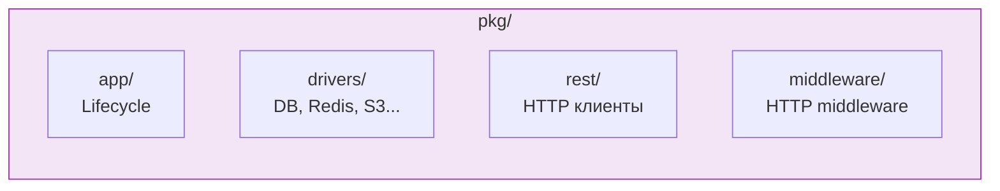

**Назначение:** Runtime-библиотеки, максимально переиспользуемые между проектами.

**Требования:**

- ✗ Нет зависимостей от конфига проекта
- ✗ Нет зависимостей от конкретных реализаций логгера
- ✓ Может быть вынесен в отдельный go module

**Содержимое:**

| Директория | Назначение | Примеры |
|------------|------------|---------|
| `pkg/app/` | Жизненный цикл приложения | `Runnable` интерфейс, graceful shutdown |
| `pkg/drivers/` | Драйверы внешних сервисов | PostgreSQL, Redis, S3, Telegram |
| `pkg/rest/` | Сгенерированные REST клиенты | Ogen-клиенты для внешних API |
| `pkg/middleware/` | HTTP middleware | Metrics, tracing, auth |

### Слой `internal/pkg/` (Generated Core)

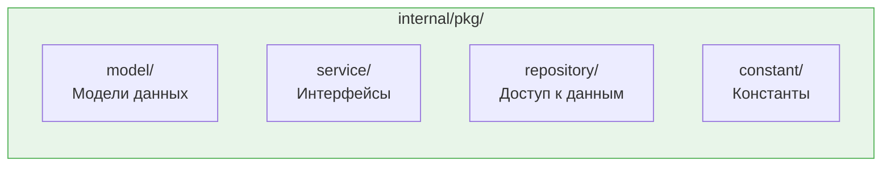

**Назначение:** Генерируемый код, переиспользуемый между приложениями одного сервиса.

**Требования:**

- ✗ Не зависит от проект-специфичных настроек
- ✗ Не привязан к конкретному логгеру
- ✓ Функции возвращают ошибки вверх, логирование — на верхнем уровне

**Содержимое:**

| Директория | Назначение | Пример кода |
|------------|------------|-------------|
| `model/` | Модели данных | `type User struct {...}` |
| `service/` | Интерфейсы сервисов | `type UserService interface {...}` |
| `repository/` | Репозитории | `func (r *Repo) GetUser(ctx, id)` |
| `constant/` | Константы | `const ServiceName = "my-api"` |

### Слой `internal/app/` (Project-Specific)

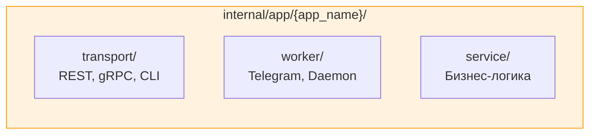

**Назначение:** Код, специфичный для конкретного приложения.

**Характеристики:**

- ✓ Может зависеть от конфига
- ✓ Может использовать конкретные реализации (логгер, драйверы)
- ✓ Содержит бизнес-логику обработчиков

**Содержимое:**

| Директория | Назначение | Пример |
|------------|------------|--------|
| `transport/rest/` | REST обработчики | `handler.go` с методами API |
| `transport/grpc/` | gRPC реализации | Реализация proto-сервисов |
| `worker/` | Фоновые воркеры | Telegram bot, Kafka consumer |
| `service/` | Бизнес-логика | Специфичная для приложения логика |

## Service — ядро бизнес-логики

**Service** — это центральный компонент, который содержит всю бизнес-логику приложения. Независимо от количества транспортов, воркеров или ботов — все они обращаются к одному и тому же сервису.

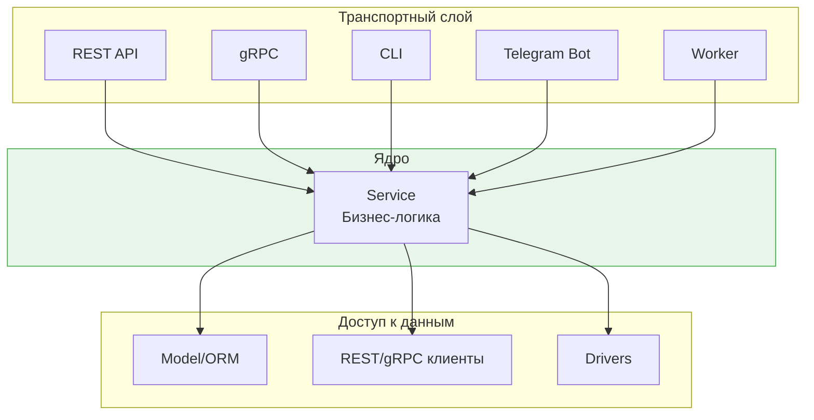

**Ключевые принципы:**

1. **Единственное место для бизнес-логики** — вся переиспользуемая логика лежит в сервисе
2. **Изолированность** — сервис не знает о транспортах, он просто выполняет бизнес-операции
3. **Подготовка к масштабированию** — при распиливании монорепо на микросервисы, именно сервис будет рефакториться

**Что доступно сервису:**

| Компонент | Назначение |
|-----------|------------|
| **Model** | ORM для работы с базами данных (по умолчанию go-active-record) |
| **Client** | Сгенерированные клиенты к другим сервисам (REST, gRPC) |
| **Driver** | Кастомные коннекторы к внешним системам |
| **Config** | Конфигурация через OnlineConf (синглтон) |

**Важно:** Уделяйте особое внимание структуре пакетов внутри сервиса. Каждый компонент должен быть изолирован, чтобы в будущем его было проще выделить в отдельный микросервис.

## Типы транспортов

Транспортный слой делится на 4 типа по способу получения событий:

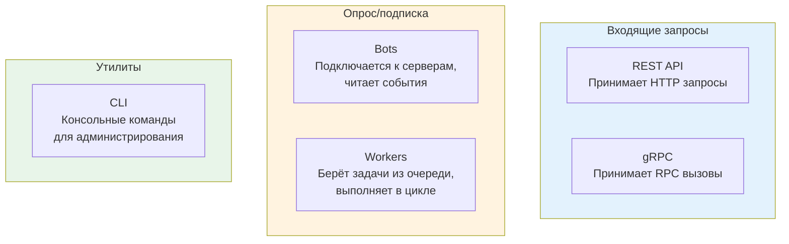

| Тип | Описание | Примеры |
|-----|----------|---------|
| **API (REST/gRPC)** | Принимают внешние запросы, обрабатывают, отвечают | HTTP эндпоинты, gRPC сервисы |
| **Workers** | Демоны с бесконечным циклом, выполняют джобы пачками | Обработка очередей, cron-задачи |
| **Bots** | Подключаются к внешним серверам, ждут события | Telegram, Slack боты |
| **CLI** | Консольные утилиты для разовых операций | Миграции, админские команды |

**Workers vs Bots:**

- **Workers** — сами берут задачи (pull-модель)
- **Bots** — получают события от внешних систем (push-модель)

## Концепция Application

**Application** — атомарная единица горизонтального масштабирования (контейнер).

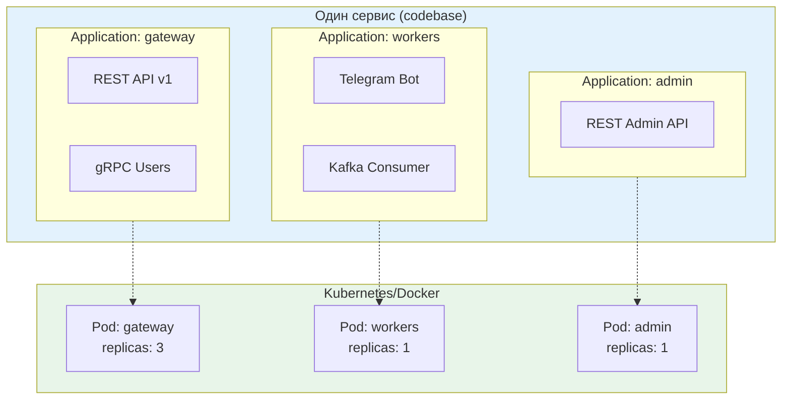

### Характеристики

| Свойство | Описание |
|----------|----------|
| **Атомарность** | Один бинарь = один контейнер = один pod |
| **Компоненты** | HTTP серверы, gRPC серверы, воркеры инициализируются параллельно |
| **Масштабирование** | Каждое application масштабируется независимо |
| **Конфигурация** | Каждое application может иметь свои настройки |

```yaml
applications:
  # API Gateway с REST и gRPC (высоконагруженный)
  - name: gateway
    transport:
      - name: rest_api
      - name: grpc_users

  # Выделенный worker instance (один экземпляр)
  - name: workers
    worker: [telegram_bot]
    kafka: [order_consumer]

  # Всё-в-одном для небольших деплоев
  - name: monolith
    transport:
      - name: rest_api
      - name: grpc_users
    worker: [telegram_bot]
```

### Жизненный цикл Application

```mermaid
stateDiagram-v2
    [*] --> Init: Запуск

    state Init {
        [*] --> LoadConfig: 1. Загрузка конфига
        LoadConfig --> CreateLogger: 2. Создание логгера
        CreateLogger --> InitDrivers: 3. Init драйверов
        InitDrivers --> [*]
    }

    Init --> Run: Успешная инициализация

    state Run {
        [*] --> RunDrivers: 1. Run драйверов
        RunDrivers --> StartHTTP: 2. Запуск HTTP серверов
        StartHTTP --> StartGRPC: 3. Запуск gRPC серверов
        StartGRPC --> StartWorkers: 4. Запуск воркеров
        StartWorkers --> Serving: Все компоненты запущены
        Serving --> [*]: SIGTERM/SIGINT
    }

    Run --> Shutdown: Сигнал завершения

    state Shutdown {
        [*] --> GracefulWorkers: 1. Graceful shutdown воркеров
        GracefulWorkers --> StopHTTP: 2. Остановка HTTP (drain)
        StopHTTP --> StopGRPC: 3. Остановка gRPC
        StopGRPC --> ShutdownDrivers: 4. Shutdown драйверов
        ShutdownDrivers --> [*]
    }

    Shutdown --> [*]: Завершение
```

## Сохранение пользовательского кода

**Главная особенность:** Перегенерируйте весь проект без потери ваших изменений.

Каждый сгенерированный файл содержит disclaimer-маркер:

```go
// ==========================================
// GENERATED CODE - DO NOT EDIT ABOVE THIS LINE
// Changes manually made below will not be overwritten by generator.
// ==========================================

func (h *Handler) CreateUser(ctx context.Context, req *CreateUserRequest) (*User, error) {
    // Ваша бизнес-логика здесь
    // Этот код переживёт регенерацию!

    user := &User{
        Email: req.Email,
        Name:  req.Name,
    }

    // Кастомная валидация
    if err := h.validateBusinessRules(user); err != nil {
        return nil, err
    }

    return h.repo.Create(ctx, user)
}
```

**Правила:**

1. Код выше маркера регенерируется при каждом запуске
2. Код ниже маркера сохраняется навсегда
3. Если нужно изменить сгенерированный код — переместите его ниже маркера

## Драйверы интеграций

**Драйвер** — адаптер между бизнес-логикой и внешним API.

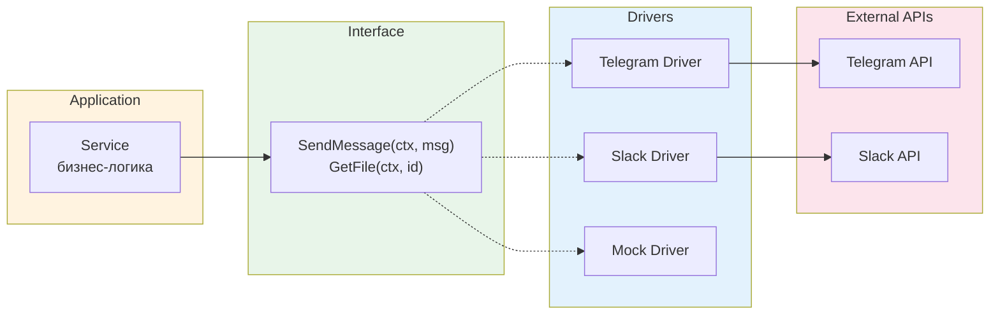

### Принцип работы

| Компонент | Ответственность |
|-----------|-----------------|
| **Service** | Вызывает абстрактный интерфейс ("отправь сообщение") |
| **Interface** | Определяет контракт (что можно делать) |
| **Driver** | Транслирует вызов в конкретный API |

**Преимущества:**

- Замена провайдера без изменения бизнес-логики
- Лёгкое тестирование через mock-драйверы
- Поддержка нескольких провайдеров одновременно

### Интерфейс Runnable

Все драйверы реализуют унифицированный интерфейс жизненного цикла:

```go
type Runnable interface {
    Init(ctx context.Context) error           // Инициализация подключений
    Run(ctx context.Context) error            // Запуск фоновых процессов
    Shutdown(ctx context.Context) error       // Немедленная остановка
    GracefulShutdown(ctx context.Context) error // Graceful остановка
}
```

### Типы драйверов

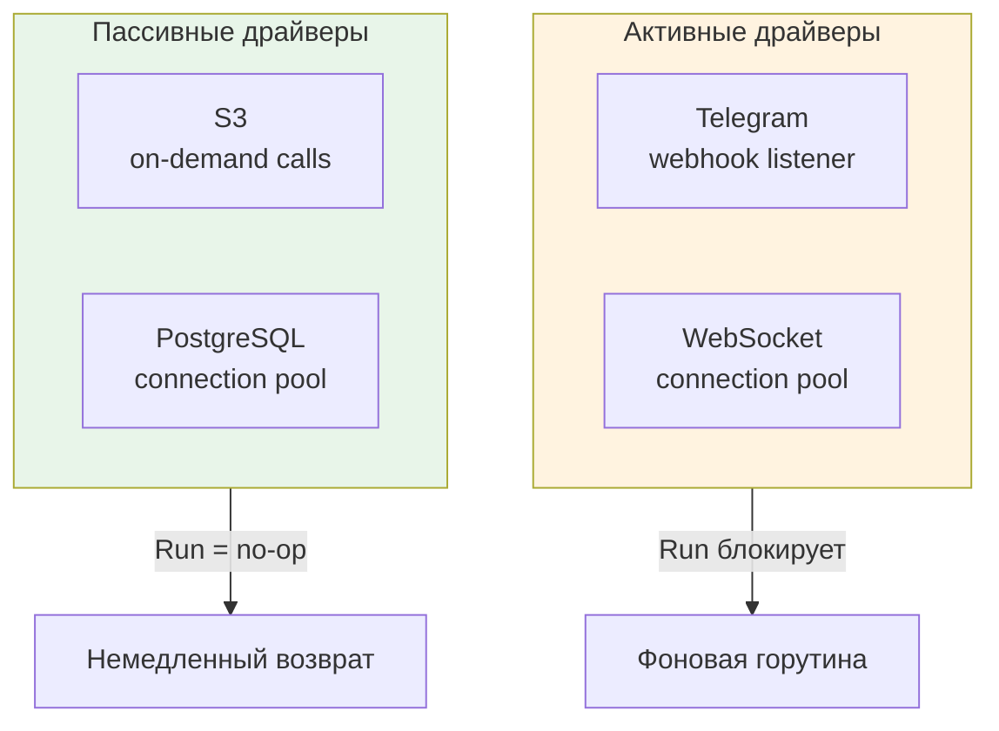

| Тип | Примеры | Метод Run |
|-----|---------|-----------|
| **Активные** | Telegram, WebSocket | Блокирует, слушает события |
| **Пассивные** | S3, PostgreSQL | No-op, вызовы по требованию |

## Middleware Stack

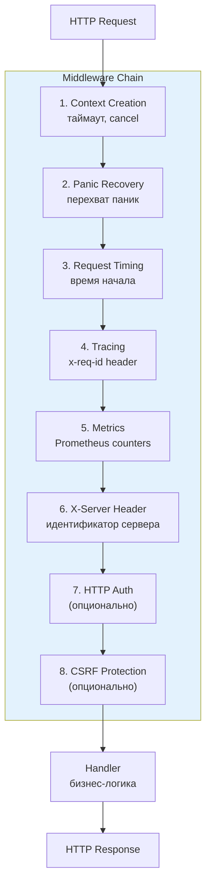

### Описание middleware

| # | Middleware | Назначение |
|---|------------|------------|
| 1 | **Context Creation** | Создание request context с таймаутом и cancel функцией |
| 2 | **Panic Recovery** | Перехват паник, логирование stack trace, возврат 500 |
| 3 | **Request Timing** | Добавление времени начала запроса в context |
| 4 | **Tracing** | Добавление/проброс trace ID (`x-req-id` header) |
| 5 | **Metrics** | Сбор Prometheus метрик (latency, status codes, in-flight) |
| 6 | **X-Server Header** | Добавление заголовка с идентификатором сервера |
| 7 | **HTTP Auth** | Actor-based аутентификация (опционально) |
| 8 | **CSRF Protection** | Валидация CSRF токена (опционально) |

## Поток запроса (Request Flow)

Полный путь HTTP-запроса через систему:

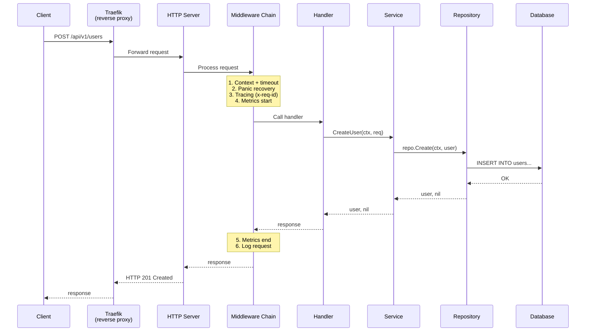

## Структура сгенерированного проекта

```
myservice/                         # ~50 файлов, ~8000 строк кода
├── cmd/
│   └── server/                    # Точка входа приложения
│       └── main.go
│
├── internal/
│   ├── app/                       # Проект-специфичный код
│   │   └── {app_name}/
│   │       ├── transport/
│   │       │   ├── rest/
│   │       │   │   └── {api_name}/
│   │       │   │       ├── handler.go     # ← ВАШ КОД ЗДЕСЬ
│   │       │   │       └── middleware.go
│   │       │   └── grpc/
│   │       │       └── {service_name}/
│   │       │           └── handler.go
│   │       ├── worker/
│   │       │   ├── telegram/
│   │       │   │   └── handler.go
│   │       │   └── daemon/
│   │       │       └── handler.go
│   │       └── service/
│   │           └── service.go            # ← ВАШ КОД ЗДЕСЬ
│   │
│   └── pkg/                       # Переиспользуемый код
│       ├── model/                 # Модели данных
│       ├── repository/            # Доступ к данным
│       ├── service/               # Интерфейсы сервисов
│       └── constant/              # Константы (ServiceName)
│
├── pkg/                           # Runtime библиотеки
│   ├── app/                       # Lifecycle
│   ├── drivers/                   # DB, Redis, S3...
│   ├── rest/                      # HTTP клиенты
│   └── middleware/                # HTTP middleware
│
├── api/                           # API спецификации
│   ├── openapi.yaml               # OpenAPI 3.0
│   └── proto/                     # Protobuf файлы
│
├── docker-compose.yaml            # Локальное окружение
├── docker-compose-dev.yaml        # Dev окружение с OnlineConf
├── Dockerfile                     # Multi-stage build (~50MB)
├── Makefile                       # 40+ targets
│
└── .github/
    └── workflows/                 # CI/CD
        ├── ci.yaml                # Test, lint, build
        └── release.yaml           # Docker push
```

## Генерируемые endpoints

### System Health/Monitoring (шаблон `sys`)

| Метод | Путь | Назначение |
|-------|------|------------|
| GET | `/version` | Информация о версии |
| GET | `/ready` | Readiness probe |
| GET | `/live` | Liveness probe |
| GET | `/metrics` | Prometheus метрики |
| GET | `/debug/pprof/*` | Go pprof профилирование |

