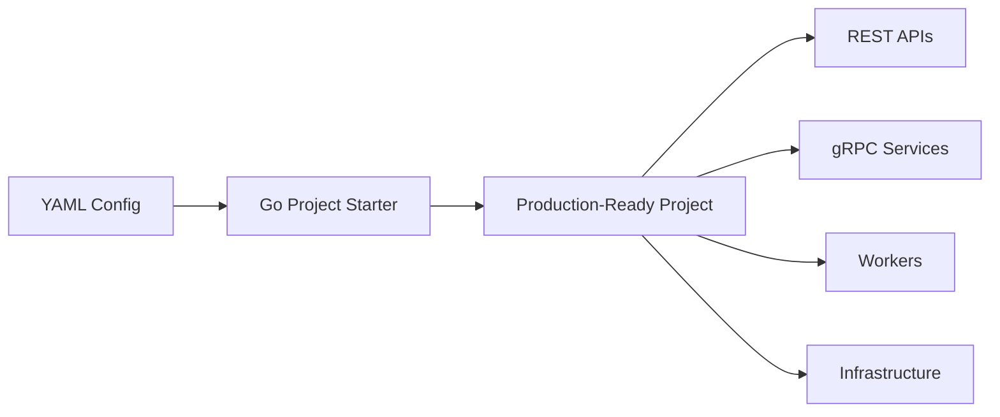

# Архитектура

Этот раздел описывает архитектуру сгенерированных проектов Go Project Starter.

!!! note "Архитектура генератора"
    Если вас интересует внутреннее устройство самого генератора, см. раздел [Разработка генератора](../development/index.md).

## Содержание раздела

- [Архитектура сгенерированного проекта](generated-project.md) — структура и паттерны сгенерированных проектов
- [Система очередей](queue-system.md) — архитектура Worker/JobProcessor/Handler для обработки очередей

!!! tip "Архитектура генератора"
    Описание внутреннего устройства генератора находится в разделе [Разработка генератора](../development/generator.md).

## Обзор

Go Project Starter — это **генератор кода**, а не фреймворк или библиотека. Он читает YAML-конфигурацию и создаёт полностью готовый к запуску Go-проект с использованием встроенных шаблонов.



## Ключевые концепции

### Application

**Application** — атомарная единица горизонтального масштабирования (контейнер).

- Один бинарь/контейнер может включать несколько компонентов
- HTTP серверы, gRPC серверы, воркеры инициализируются параллельно
- Каждый application масштабируется независимо

```yaml
applications:
  # API Gateway с REST и gRPC
  - name: gateway
    transport: [rest_api, grpc_users]

  # Выделенный worker instance
  - name: workers
    workers: [telegram_bot, kafka_consumer]
```

### Transport

**Transport** — слой доставки запросов к сервису.

| Транспорт | Протокол | Жизненный цикл |
|-----------|----------|----------------|
| **REST** | HTTP/JSON | Слушает порт → обрабатывает запросы |
| **gRPC** | HTTP2/protobuf | Слушает порт → обрабатывает запросы |
| **CLI** | stdin/stdout | Получает команду → выполняет → завершается |
| **Kafka** | Kafka protocol | Слушает топики → обрабатывает события |

### Driver

**Driver** — адаптер между бизнес-логикой и внешним API (Telegram, S3, и т.д.)

Все драйверы реализуют интерфейс `Runnable`:

```go
type Runnable interface {
    Init(ctx context.Context) error
    Run(ctx context.Context) error
    Shutdown(ctx context.Context) error
    GracefulShutdown(ctx context.Context) error
}
```

- **Активные драйверы** (Telegram) — имеют фоновые процессы
- **Пассивные драйверы** (S3) — no-op в методе Run

### Disclaimer-маркеры

Уникальная особенность генератора — сохранение пользовательского кода при регенерации:

```go
// ==========================================
// GENERATED CODE - DO NOT EDIT ABOVE THIS LINE
// ==========================================

func (h *Handler) CreateUser(ctx context.Context, req *CreateUserRequest) (*User, error) {
    // Ваш код здесь - переживёт регенерацию!
}
```

## Следующие шаги

- [Архитектура сгенерированного проекта](generated-project.md) — структура проектов
- [Система очередей](queue-system.md) — Worker, JobProcessor, Storage, Handler
- [Архитектура генератора](../development/generator.md) — внутреннее устройство генератора
