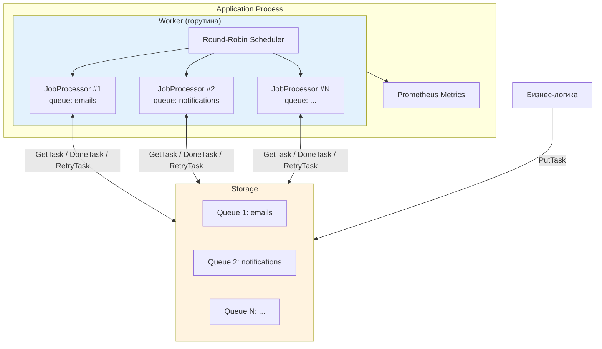
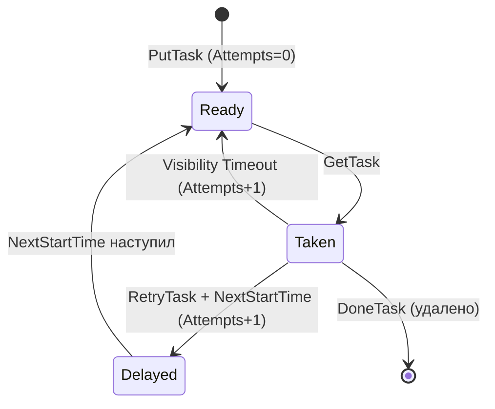
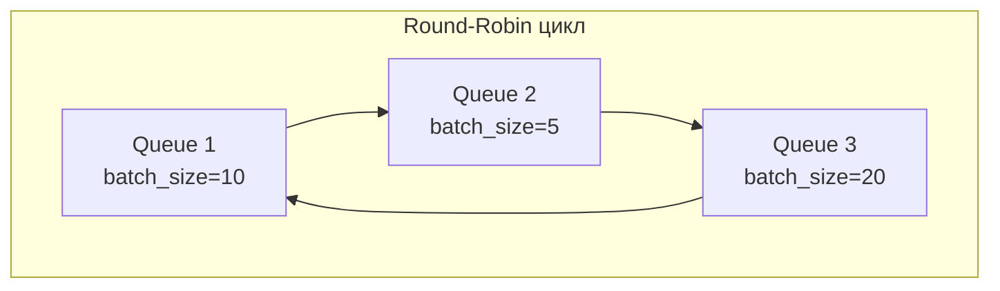
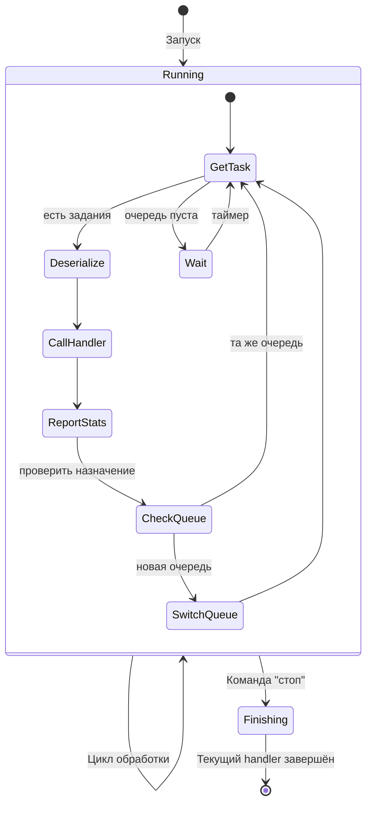
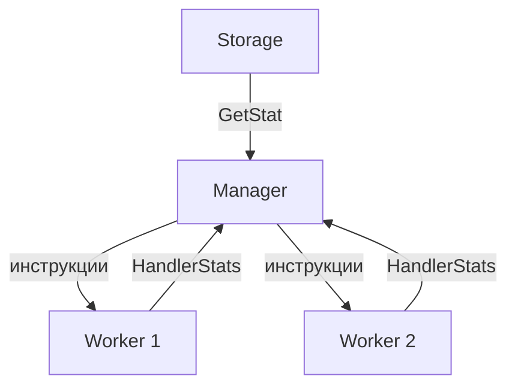

# Система очередей

Архитектура и поведение системы обработки очередей в сгенерированных проектах.

## Обзор

Система очередей предоставляет механизм фоновой обработки заданий с гарантированной доставкой. Задания хранятся в хранилище (Storage), обрабатываются горутинами (JobProcessor), управляемыми воркером (Worker). Каждое задание — это `[]byte` payload, десериализуемый в типизированную структуру на основе контракта очереди.



## Ключевые понятия

| Понятие | Описание |
|---------|----------|
| **Storage** | Хранилище очередей. Обеспечивает атомарные операции и гарантированную обработку заданий. Реализации: in-memory, Tarantool (планируется) |
| **Worker** | Горутина верхнего уровня, управляющая пулом JobProcessor-ов. Реализует интерфейс `Runnable` (Init/Run/Shutdown/GracefulStop) |
| **JobProcessor** | Горутина, непрерывно обрабатывающая задания из назначенной очереди. Количество ограничено настройкой (default: 1) |
| **Handler** | Типизированный обработчик, реализуемый пользователем. Получает десериализованные задания и Storage для управления их статусом |
| **Queue Contract** | YAML-файл с описанием очередей: ID, имя, структура данных. Аналог OpenAPI спецификации |

## Компоненты

### Storage (хранилище)

Storage — это интерфейс, описывающий хранилище очередей. Расположен в runtime-пакете (`go-project-starter-runtime`).

```go
type Storage interface {
    // GetTask атомарно берёт до count заданий из очереди queueNum.
    // Взятые задания помечаются как "в обработке" и не выдаются другим
    // обработчикам в течение visibility timeout.
    GetTask(ctx context.Context, queueNum int, count int) ([]Task, error)

    // DoneTask отмечает задания как выполненные. Они удаляются из хранилища.
    DoneTask(ctx context.Context, taskIDs []int64) error

    // RetryTask возвращает задания в очередь с указанным временем следующего запуска.
    RetryTask(ctx context.Context, retries []RetryInfo) error

    // PutTask добавляет новое задание в очередь.
    PutTask(ctx context.Context, req PutTaskRequest) error

    // GetStat возвращает статистику по всем очередям.
    GetStat(ctx context.Context) (*Stats, error)
}
```

#### Структуры данных

```go
// Task — задание, полученное из хранилища
type Task struct {
    ID            int64     // Уникальный идентификатор задания
    QueueNum      int       // Номер очереди
    Data          []byte    // Payload (сериализованные данные)
    Attempts      int       // Сколько раз задание возвращалось в очередь (0 = первая попытка)
    CreatedAt     time.Time // Время создания задания
    StartTime     time.Time // Время текущей активации (когда задание стало доступным)
    PrevStartTime time.Time // Время предыдущей активации (zero value при первой попытке)
}

// RetryInfo — информация для повторной обработки задания
type RetryInfo struct {
    TaskID        int64     // ID задания
    NextStartTime time.Time // Когда задание снова станет доступным
}

// PutTaskRequest — запрос на добавление задания
type PutTaskRequest struct {
    QueueNum  int            // Номер очереди
    Data      []byte         // Payload
    StartTime *time.Time     // Абсолютное время запуска (взаимоисключающее с Delay)
    Delay     time.Duration  // Относительная задержка от текущего момента
}
```

#### Гарантии хранилища

1. **Атомарность GetTask** — одно задание в рамках visibility timeout не выдаётся двум обработчикам
2. **Гарантированная обработка** — если задание взято, но не отмечено как выполненное (DoneTask) или отложенное (RetryTask), оно автоматически возвращается в очередь после visibility timeout
3. **Без лимита retry** — задание обрабатывается бесконечно, пока не будет вызван DoneTask
4. **Отложенные задания** — PutTask с StartTime/Delay откладывает появление задания в очереди

### Механизм ретраев

Система поддерживает два способа повторной обработки задания: **явный retry** (через handler) и **автоматический retry** (через visibility timeout).

#### Счётчик попыток (Attempts)

Поле `Attempts` в задании инкрементируется **Storage при возврате задания в очередь** — будь то явный RetryTask или автоматический возврат по visibility timeout.

| Событие | Attempts | PrevStartTime |
|---------|----------|---------------|
| PutTask (создание) | 0 | zero value |
| Первый GetTask | 0 (ещё не было возвратов) | zero value |
| RetryTask | +1 | предыдущий StartTime |
| Visibility timeout (handler не ответил) | +1 | предыдущий StartTime |
| Второй GetTask (после retry) | 1 | время первой активации |

Handler видит текущее значение `Attempts` в типизированной структуре рядом с `TaskID`:

```go
type EmailsTask struct {
    TaskID        int64     // ID задания в хранилище
    Attempts      int       // Сколько раз задание возвращалось в очередь (0 = первая попытка)
    PrevStartTime time.Time // Время предыдущей активации (zero value при первой попытке)
    To            string
    Subject       string
    Body          []byte
}
```

#### Явный retry (RetryTask)

Handler решает, что задание нужно обработать позже, и вызывает `storage.RetryTask` с указанием `NextStartTime`:

```go
// Экспоненциальный backoff на основе Attempts
delay := time.Duration(math.Pow(2, float64(task.Attempts))) * time.Second
s.RetryTask(ctx, []queue.RetryInfo{
    {TaskID: task.TaskID, NextStartTime: time.Now().Add(delay)},
})
```

Что происходит внутри Storage:

1. Задание снимается со статуса "taken" (в обработке)
2. `Attempts` инкрементируется на 1
3. `PrevStartTime` сохраняет текущий `StartTime` (время активации, при которой задание было взято)
4. `StartTime` устанавливается в `NextStartTime`
5. Задание не будет выдано через GetTask, пока не наступит `NextStartTime`

#### Автоматический retry (visibility timeout)

Если handler взял задание через GetTask, но не вызвал ни DoneTask, ни RetryTask (например, процесс упал):

1. Storage ждёт `visibility_timeout` (default: 60 секунд)
2. По истечении таймаута задание автоматически возвращается в очередь
3. `Attempts` инкрементируется на 1
4. `PrevStartTime` сохраняет текущий `StartTime`
5. `StartTime` устанавливается в текущее время (задание сразу доступно)
6. Следующий вызов GetTask может его получить



#### Без лимита retry

Система **не ограничивает** количество retry. Задание будет возвращаться в очередь бесконечно, пока handler не вызовет DoneTask. Это design decision — логику "мёртвых" заданий (dead letter) реализует handler на основе `Attempts`:

```go
func (h *handler) HandleEmails(ctx context.Context, s queue.Storage, tasks []*EmailsTask) (queue.HandlerStats, error) {
    // ...
    for _, task := range tasks {
        if task.Attempts > 10 {
            // "Dead letter" — логируем и завершаем
            log.Error().Int("attempts", task.Attempts).Msg("task exceeded max retries, dropping")
            doneIDs = append(doneIDs, task.TaskID)
            stats.Errors++
            continue
        }

        err := h.process(ctx, task)
        if err != nil {
            delay := time.Duration(math.Pow(2, float64(task.Attempts))) * time.Second
            retries = append(retries, queue.RetryInfo{
                TaskID:        task.TaskID,
                NextStartTime: time.Now().Add(delay),
            })
        } else {
            doneIDs = append(doneIDs, task.TaskID)
            stats.Processed++
        }
    }
    // ...
}
```

#### Статистика (GetStat)

```go
type Stats struct {
    QueueStats map[int]QueueStat
}

type QueueStat struct {
    QueueNum     int   // Номер очереди
    TotalTasks   int64 // Всего заданий
    ReadyTasks   int64 // Готовы к выдаче
    TakenTasks   int64 // Взяты, ещё не завершены
    DelayedTasks int64 // Ожидают StartTime
}
```

#### Реализации

| Реализация | Описание | Статус |
|------------|----------|--------|
| **In-Memory** | Простейшая реализация для разработки и тестов. Данные теряются при перезапуске | MVP |
| **Tarantool** | Персистентное хранилище с iproto протоколом | Планируется |

### Worker

Worker — горутина верхнего уровня, управляющая пулом JobProcessor-ов. Реализует интерфейс `Runnable`:

```
Init() → Run() → [работа] → Shutdown() → GracefulStop()
```

#### Поведение в автономном режиме (без Manager)

Worker самостоятельно распределяет JobProcessor-ы по очередям в режиме **round-robin**:



1. Worker назначает JobProcessor на очередь N
2. JobProcessor берёт `batch_size` заданий из очереди N и обрабатывает их
3. После завершения batch, Worker переназначает JobProcessor на очередь N+1
4. Цикл повторяется по всем очередям

#### Поведение с Manager

Manager отправляет Worker-у инструкции по распределению ресурсов:
- Сколько JobProcessor-ов на какую очередь направить
- Если Manager не отправляет инструкций — Worker продолжает работать как работал
- Если Worker ничего не делал и Manager молчит — продолжает ничего не делать

#### Конфигурация Worker (OnlineConf)

| Путь | Описание | Default |
|------|----------|---------|
| `{service}/worker/queue/{name}/max_processors` | Максимум JobProcessor-ов | 1 |
| `{service}/worker/queue/{name}/visibility_timeout` | Visibility timeout (сек) | 60 |
| `{service}/worker/queue/{name}/queue/{id}/batch_size` | Размер batch для очереди | 10 |

### JobProcessor

JobProcessor — горутина, непрерывно обрабатывающая задания из назначенной очереди.

#### Жизненный цикл



#### Поведение

1. **Непрерывная работа** — JobProcessor работает, пока ему не скажут остановиться
2. **Graceful stop** — при команде на остановку дорабатывает текущий handler call и завершается
3. **Смена очереди** — Worker может изменить назначение; после завершения текущего batch JobProcessor переходит на новую очередь
4. **Мониторинг 10 секунд** — один цикл (взять batch + обработать) рекомендуется завершать за 10 секунд. Превышение фиксируется в метриках. Это best practice для быстрого graceful shutdown при обновлении/перезапуске

#### Цикл обработки (один iteration)

```
1. storage.GetTask(queueNum, batchSize) → []Task
2. Десериализация Data → []*TypedTask (через сгенерированный iproto десериализатор)
3. handler.Handle{Name}(ctx, storage, typedTasks) → (HandlerStats, error)
4. Handler внутри: обработка каждого задания → storage.DoneTask / storage.RetryTask
5. JobProcessor возвращает HandlerStats worker-у
6. Проверка: не изменилась ли назначенная очередь?
7. Повтор с шага 1
```

### Handler (обработчик)

Handler — типизированный интерфейс, генерируемый для каждой очереди. Пользователь реализует этот интерфейс.

```go
// Сгенерированный интерфейс для очереди "emails"
type EmailsHandler interface {
    HandleEmails(ctx context.Context, storage queue.Storage, tasks []*EmailsTask) (queue.HandlerStats, error)
}
```

Handler получает:
- **ctx** — контекст с таймаутами и отменой
- **storage** — прямой доступ к Storage для вызова DoneTask, RetryTask, PutTask (создание новых заданий)
- **tasks** — типизированные задания с TaskID и десериализованными полями

Handler возвращает:
- **HandlerStats** — статистика обработки (processed, errors, retried, duration, lastError)
- **error** — критическая ошибка (ошибки отдельных заданий обрабатываются внутри через RetryTask)

```go
type HandlerStats struct {
    Processed int           // Успешно обработано
    Errors    int           // Ошибки при обработке
    Retried   int           // Отправлено на повтор
    Duration  time.Duration // Время обработки batch
    LastError error         // Последняя ошибка (для логирования)
}
```

#### Пример реализации handler

```go
func (h *emailHandler) HandleEmails(ctx context.Context, s queue.Storage, tasks []*EmailsTask) (queue.HandlerStats, error) {
    start := time.Now()
    stats := queue.HandlerStats{}

    var doneIDs []int64
    var retries []queue.RetryInfo

    for _, task := range tasks {
        err := h.sendEmail(ctx, task.To, task.Subject, task.Body)
        if err != nil {
            stats.Errors++
            stats.LastError = err
            retries = append(retries, queue.RetryInfo{
                TaskID:        task.TaskID,
                NextStartTime: time.Now().Add(30 * time.Second),
            })
        } else {
            stats.Processed++
            doneIDs = append(doneIDs, task.TaskID)
        }
    }

    if len(doneIDs) > 0 {
        if err := s.DoneTask(ctx, doneIDs); err != nil {
            return stats, fmt.Errorf("done task: %w", err)
        }
    }
    if len(retries) > 0 {
        stats.Retried = len(retries)
        if err := s.RetryTask(ctx, retries); err != nil {
            return stats, fmt.Errorf("retry task: %w", err)
        }
    }

    stats.Duration = time.Since(start)
    return stats, nil
}
```

## Сериализация данных

Задания хранятся в Storage как `[]byte`. Для сериализации/десериализации используется **iproto** (msgpack-based протокол Tarantool). Это обеспечивает совместимость с Tarantool-хранилищем.

Генератор создаёт для каждой очереди:
- **Go struct** с полями из контракта + поле `TaskID int64`
- **Serializer** — `Serialize{Name}Task(*Task) ([]byte, error)`
- **Deserializer** — `Deserialize{Name}Task([]byte) (*Task, error)`

Поддерживаемые типы полей:

| YAML тип | Go тип | Описание |
|----------|--------|----------|
| `int` | `int` | Целое число |
| `int64` | `int64` | 64-битное целое |
| `string` | `string` | Строка |
| `bool` | `bool` | Булево значение |
| `[]byte` | `[]byte` | Массив байт |
| `[]int` | `[]int` | Слайс целых чисел |
| `[]int64` | `[]int64` | Слайс 64-битных целых |

## Метрики

Prometheus метрики, регистрируемые при наличии `prometheus.Registry`:

| Метрика | Тип | Labels | Описание |
|---------|-----|--------|----------|
| `queue_job_processor_cycle_duration_seconds` | Histogram | `queue_num` | Время одного цикла JobProcessor |
| `queue_tasks_in_progress` | Gauge | `queue_num` | Количество заданий в обработке |
| `queue_running_workers` | Gauge | — | Количество запущенных Worker-ов |
| `queue_running_job_processors` | Gauge | — | Количество запущенных JobProcessor-ов |

## Manager (планируется)

Manager — компонент верхнего уровня, распределяющий ресурсы Worker-ов на основе статистики.



- Получает статистику от Storage (`GetStat`) и от Worker-ов (`HandlerStats`)
- Определяет оптимальное распределение JobProcessor-ов по очередям
- Отправляет инструкции Worker-ам
- При отсутствии Manager или его инструкций Worker-ы работают автономно (round-robin)

Правила распределения будут определены в отдельной фазе разработки.

## Жизненный цикл системы

```
┌─────────────────────────────────────────────────────────────┐
│                       ИНИЦИАЛИЗАЦИЯ                          │
│  1. Создание Storage (in-memory или Tarantool)              │
│  2. Создание Worker с указанием очередей и handler-ов       │
│  3. Регистрация метрик в Prometheus                         │
└─────────────────────────────────────────────────────────────┘
                            │
                            ▼
┌─────────────────────────────────────────────────────────────┐
│                         ЗАПУСК                               │
│  1. Worker запускает N JobProcessor-ов (по max_processors)  │
│  2. Каждый JobProcessor начинает цикл обработки             │
│  3. Worker назначает очереди round-robin                    │
└─────────────────────────────────────────────────────────────┘
                            │
                            ▼
┌─────────────────────────────────────────────────────────────┐
│                         РАБОТА                               │
│  - JobProcessor-ы непрерывно обрабатывают задания           │
│  - Worker перераспределяет процессоры по очередям           │
│  - Метрики обновляются после каждого цикла                  │
│  - Storage автоматически возвращает просроченные задания    │
└─────────────────────────────────────────────────────────────┘
                            │
                            ▼
┌─────────────────────────────────────────────────────────────┐
│                       ЗАВЕРШЕНИЕ                             │
│  1. Получен сигнал остановки (context cancellation)         │
│  2. Worker отправляет "стоп" всем JobProcessor-ам           │
│  3. Каждый JobProcessor дорабатывает текущий handler call   │
│  4. Worker ожидает завершения всех JobProcessor-ов          │
│  5. Ресурсы освобождаются                                   │
└─────────────────────────────────────────────────────────────┘
```
