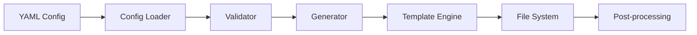
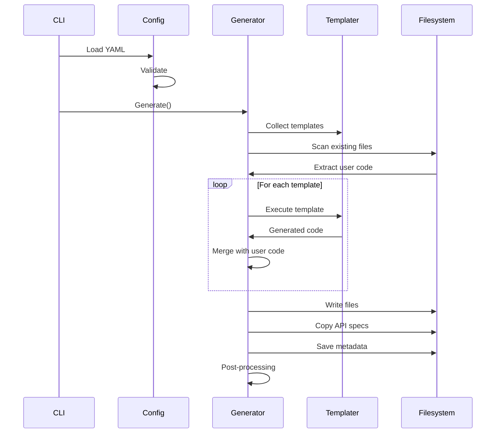

# Архитектура генератора

Go Project Starter — это генератор кода, который читает YAML-конфигурацию и создаёт полностью готовый к запуску Go-проект.

## Обзор



## Ключевые компоненты

### Структура пакетов

```
internal/pkg/
├── config/       # Загрузка и валидация конфигурации
├── generator/    # Оркестрация генерации
├── templater/    # Движок шаблонов
├── meta/         # Метаданные и версионирование
├── migrate/      # Миграции между версиями
├── ds/           # Domain structures
├── init/         # Интерактивная инициализация
└── setup/        # Setup wizard
```

### config/

Загрузка и валидация YAML-конфигурации через [spf13/viper](https://github.com/spf13/viper).

**Основные функции:**

- Парсинг YAML-файлов конфигурации
- Валидация всех секций (main, git, rest, grpc, workers, applications, и т.д.)
- Создание lookup maps для быстрого доступа к элементам
- Установка значений по умолчанию

**Правила валидации:**

1. REST/gRPC сервисы должны быть назначены в applications
2. Драйверы, на которые есть ссылки, должны существовать
3. Имена транспортов, воркеров и драйверов не должны дублироваться
4. ActiveRecord требует указания ArgenVersion
5. Порты обязательны для REST (кроме шаблона `sys`)

### generator/

Оркестрация процесса генерации — центральный компонент.

**Основные этапы:**

1. Сбор шаблонов по категориям (main, transport, worker, logger, app)
2. Сканирование существующих файлов и извлечение пользовательского кода
3. Выполнение шаблонов с параметрами из конфигурации
4. Создание директорий и запись файлов
5. Копирование API-спецификаций (OpenAPI, Protobuf)
6. Сохранение метаданных генерации
7. Выполнение post-generation задач (git init, goimports, go mod tidy)

### templater/

Движок шаблонов с поддержкой сохранения пользовательского кода.

**Особенности:**

- Использование стандартного Go `text/template`
- Embedded filesystem для хранения 78+ шаблонов
- Disclaimer-маркеры для разделения сгенерированного и пользовательского кода
- Кэширование скомпилированных шаблонов

**Структура шаблонов:**

```
templater/embedded/templates/
├── main/              # Makefile, Dockerfile, docker-compose, configs
├── transport/
│   ├── rest/
│   │   ├── ogen/      # OpenAPI 3.0 кодогенерация
│   │   └── template/
│   │       └── sys/   # Health checks, метрики, pprof
│   ├── grpc/          # gRPC сервисы
│   └── kafka/         # Kafka consumers
├── worker/
│   └── template/
│       ├── telegram/  # Telegram бот
│       └── daemon/    # Background daemon
├── app/               # Application layer
└── logger/            # Logger implementations (zerolog, logrus)
```

### meta/

Управление версиями генератора и метаданными проекта.

**Функции:**

- Хранение версии генератора в `meta.yaml`
- Отслеживание параметров последней генерации
- Поддержка миграций при обновлении генератора

### migrate/

Автоматические миграции при обновлении генератора.

**Возможности:**

- Переименование файлов при изменении структуры
- Обновление устаревших конфигураций
- Удаление deprecated кода по расписанию

## Процесс генерации



### 1. Загрузка конфигурации

CLI читает YAML-файл и передаёт его в config loader. Поддерживается как один файл (`--config`), так и директория с несколькими файлами (`--configDir`).

### 2. Валидация

Config loader проверяет:

- Обязательные поля (main.name, git.repo)
- Корректность ссылок (транспорты в applications, драйверы)
- Отсутствие дубликатов имён
- Совместимость настроек

### 3. Сбор шаблонов

Generator собирает все необходимые шаблоны на основе конфигурации:

- **main/** — всегда включаются
- **transport/rest/** — если есть секция `rest`
- **transport/grpc/** — если есть секция `grpc`
- **transport/kafka/** — если есть секция `kafka`
- **worker/** — если есть секция `workers`
- **logger/** — на основе `main.logger`

### 4. Извлечение пользовательского кода

Если проект уже существует, generator сканирует файлы и извлекает код, написанный пользователем (код ниже disclaimer-маркеров).

### 5. Выполнение шаблонов

Каждый шаблон выполняется с контекстом, содержащим:

- Данные из конфигурации
- Вспомогательные функции
- Ссылки на связанные сущности

### 6. Слияние кода

Сгенерированный код объединяется с сохранённым пользовательским кодом через disclaimer-маркеры.

### 7. Запись файлов

Результат записывается в целевую директорию.

### 8. Post-processing

После генерации выполняются:

- `git init` (если нет репозитория)
- `goimports` (форматирование импортов)
- `go mod tidy` (обновление зависимостей)

## Disclaimer-система

Уникальная особенность генератора — сохранение пользовательского кода при регенерации.

### Как это работает

Каждый сгенерированный файл содержит маркер:

```go
// Сгенерированный код
package handler

import "context"

type Handler struct {}

// ==========================================
// GENERATED CODE - DO NOT EDIT ABOVE THIS LINE
// ==========================================

// Пользовательский код ниже — переживёт регенерацию
func (h *Handler) CustomMethod() {
    // Ваша бизнес-логика
}
```

### Правила работы

1. **Выше маркера** — сгенерированный код, перезаписывается при регенерации
2. **Ниже маркера** — пользовательский код, сохраняется
3. **Не редактируйте** код выше маркера — изменения будут потеряны

### Преимущества

- Регенерация проекта без потери бизнес-логики
- Обновление инфраструктуры при изменении API
- Добавление новых endpoints без ручного копирования

## Типы генераторов

### REST генераторы

| Тип | Описание | Применение |
|-----|----------|------------|
| `ogen` | OpenAPI 3.0 кодогенерация | Основные бизнес API |
| `template` | Шаблонная генерация | Системные endpoints |
| `ogen_client` | REST клиент | Вызов внешних API |

### Специальные шаблоны

- **`sys`** — системный сервер для Prometheus метрик, health checks, pprof

## Зависимость от Runtime

Генератор зависит от [go-project-starter-runtime](https://github.com/Educentr/go-project-starter-runtime) — библиотеки с runtime-компонентами (middleware, logging, metrics).

При каждом релизе генератора обновляется минимальная версия runtime:

```go
// internal/pkg/templater/templater.go
const MinRuntimeVersion = "vX.Y.Z"
```

## Следующие шаги

- [Архитектура сгенерированного проекта](../architecture/generated-project.md) — структура и паттерны
- [Руководство разработчика](index.md) — workflow и команды
