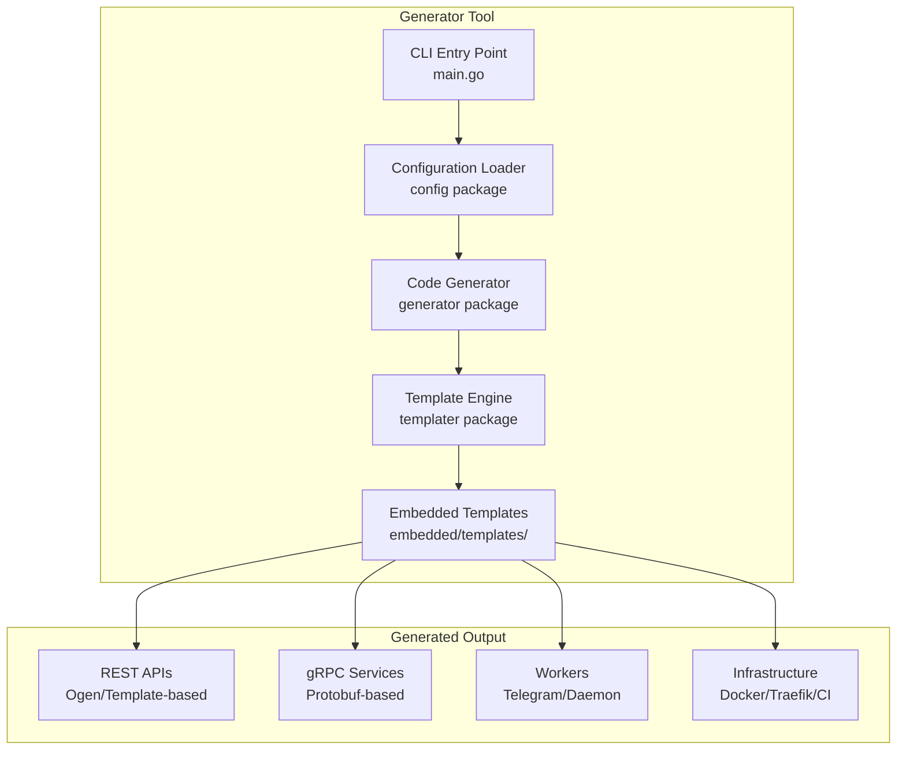
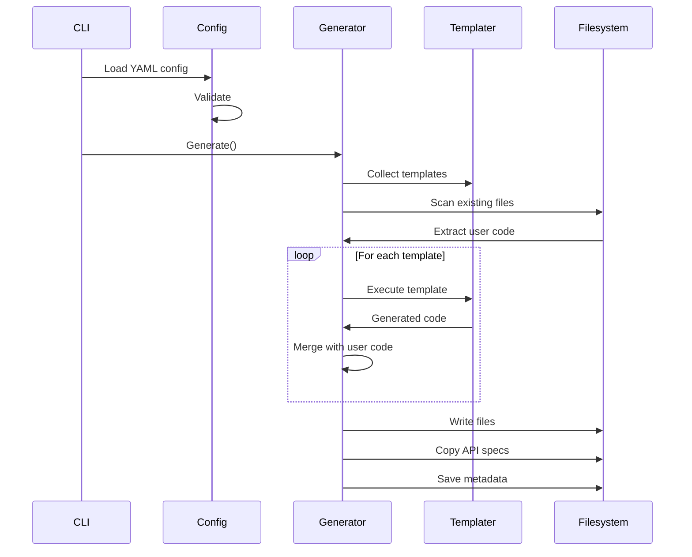

# Разработка генератора

Руководство по разработке и расширению Go Project Starter.

## Содержание раздела

- [Архитектура генератора](generator.md) — детальное описание внутреннего устройства

## Обзор архитектуры



## Структура директорий генератора

```
go-project-starter/
├── cmd/go-project-starter/    # CLI точка входа
│   └── main.go
├── internal/pkg/
│   ├── config/                # Загрузка и валидация конфигов
│   │   ├── config.go
│   │   └── structs.go
│   ├── generator/             # Оркестрация генерации
│   │   └── generator.go
│   ├── templater/             # Движок шаблонов
│   │   ├── templater.go
│   │   ├── fs.go
│   │   ├── disclaimer.go
│   │   └── embedded/templates/
│   ├── meta/                  # Версионирование
│   │   └── meta.go
│   ├── migrate/               # Миграции между версиями
│   │   └── migrate.go
│   └── ds/                    # Domain structures
│       └── const.go
├── example/                   # Примеры конфигураций
└── test/                      # Тесты
```

## Основные пакеты

### config/

Загрузка и валидация YAML-конфигурации через spf13/viper.

**Ключевые функции:**

- Парсинг YAML-файлов
- Валидация всех секций конфигурации
- Создание lookup maps для быстрого доступа
- Установка значений по умолчанию

### generator/

Оркестрация процесса генерации.

**Основные этапы:**

1. Сбор шаблонов (main, transport, worker, logger, app)
2. Извлечение пользовательского кода из существующих файлов
3. Выполнение шаблонов с параметрами конфигурации
4. Создание директорий и файлов
5. Копирование API-спецификаций
6. Сохранение метаданных
7. Выполнение post-generation задач

### templater/

Движок шаблонов с поддержкой сохранения пользовательского кода.

**Особенности:**

- Использование Go `text/template`
- Embedded filesystem для шаблонов
- Disclaimer-маркеры для разделения сгенерированного и пользовательского кода
- Кэширование шаблонов

### meta/

Управление версиями генератора и миграциями.

**Функции:**

- Отслеживание версии генератора в `meta.yaml`
- Поддержка миграций при обновлении генератора
- Переименование файлов при изменении схемы

## Процесс генерации



## Структура шаблонов

```
templater/embedded/templates/
├── main/              # Основные файлы проекта
│   ├── Makefile.tmpl
│   ├── Dockerfile.tmpl
│   ├── docker-compose.yaml.tmpl
│   └── ...
├── transport/
│   ├── rest/
│   │   ├── ogen/      # OpenAPI генератор
│   │   └── template/
│   │       └── sys/   # Системный шаблон
│   ├── grpc/          # gRPC сервисы
│   └── kafka/         # Kafka consumers
├── worker/
│   └── template/
│       ├── telegram/  # Telegram бот
│       └── daemon/    # Daemon воркер
├── app/               # Application layer
└── logger/            # Logger implementations
```

## Типы генераторов

### REST генераторы

| Тип | Описание | Применение |
|-----|----------|------------|
| `ogen` | OpenAPI 3.0 кодогенерация | Основные бизнес API |
| `template` | Шаблонная генерация | Health checks, метрики, кастомные endpoints |
| `ogen_client` | REST клиент | Вызов внешних API |

### Специальные шаблоны

- **`sys`** — сервер для Prometheus метрик, health checks, pprof

## Workflow разработки

### 1. Клонирование репозитория

```bash
git clone https://github.com/Educentr/go-project-starter
cd go-project-starter
```

### 2. Установка зависимостей

```bash
go mod download
```

### 3. Сборка

```bash
make build
# или
go build -o go-project-starter ./cmd/go-project-starter
```

### 4. Локальная установка

```bash
go install ./cmd/go-project-starter
```

### 5. Тестирование

```bash
go-project-starter --config=example/config.yaml --target=/tmp/test-project
```

## Команды

```bash
# Сборка
make build

# Тесты
make test      # С coverage
make race      # С race detector

# Linting
make install-lint   # Установка golangci-lint
make lint           # Проверка изменений
make lint-full      # Полный lint
make lint-fix       # Автоисправление

# Coverage
make coverage       # HTML отчёт
```

## Цикл разработки

```bash
# 1. Изменения в коде
# 2. Установка
go install ./cmd/go-project-starter

# 3. Тестирование
go-project-starter --config=example/config.yaml --target=/tmp/test

# 4. Lint
make lint

# 5. Commit
git add .
git commit -m "Feature: ..."
```

## Добавление нового шаблона

### Создание шаблона

1. Создайте директорию: `templates/transport/rest/template/{name}/`
2. Добавьте `.tmpl` файлы
3. Зарегистрируйте в `templater/fs.go`
4. Добавьте тесты
5. Обновите документацию

### Синтаксис шаблонов

```go
package {{ .PackageName }}

// Generated by go-project-starter
// Version: {{ .Version }}

type {{ .StructName }} struct {
    {{- range .Fields }}
    {{ .Name }} {{ .Type }} `json:"{{ .JSONName }}"`
    {{- end }}
}
```

### Переменные шаблонов

| Переменная | Описание |
|------------|----------|
| `.ProjectName` | Имя проекта |
| `.ModulePath` | Go module path |
| `.Version` | Версия API |
| `.Port` | Порт транспорта |
| `.RestName` | Имя REST транспорта |

## Правила валидации

При добавлении настроек добавьте валидацию в `config/structs.go`:

```go
func (c *Config) Validate() error {
    if c.Main.Name == "" {
        return errors.New("main.name is required")
    }

    names := make(map[string]bool)
    for _, rest := range c.Rest {
        if names[rest.Name] {
            return fmt.Errorf("duplicate rest name: %s", rest.Name)
        }
        names[rest.Name] = true
    }

    return nil
}
```

**Обязательные проверки:**

1. REST/gRPC сервисы должны быть назначены в applications
2. Драйверы, на которые есть ссылки, должны существовать
3. Имена не должны дублироваться
4. ActiveRecord требует указания ArgenVersion
5. Порты обязательны для REST (кроме шаблона `sys`)

## Тестирование генерации

```bash
# Dry-run
go-project-starter --dry-run --config=example/config.yaml --target=/tmp/test

# Полная генерация
go-project-starter --config=example/config.yaml --target=/tmp/test

# Проверка компиляции
cd /tmp/test && go build ./...
```

## Версионирование Runtime

Генератор зависит от go-project-starter-runtime. При каждом релизе необходимо обновить `MinRuntimeVersion`:

```go
// internal/pkg/templater/templater.go
const MinRuntimeVersion = "vX.Y.Z"
```

## Release Checklist

### 1. Обновление Runtime

```go
// internal/pkg/templater/templater.go
const MinRuntimeVersion = "vX.Y.Z"  // Последняя версия runtime
```

### 2. Deprecation Cleanup

1. Проверьте `internal/pkg/migrate/migrate.go`
2. Удалите устаревший код
3. Обновите `DEPRECATION.md`

### 3. GitHub Release

```bash
# Найти последний релиз
gh release list --limit 1

# Посмотреть изменения
gh release view <prev-version> --json targetCommitish -q .targetCommitish
git log --oneline <prev-commit>..HEAD

# Создать релиз
gh release create vX.Y.Z --title "vX.Y.Z - Title" --notes "..."
```

## Code Review

- Все изменения через PR
- Нужен минимум один approve
- CI должен проходить

## Ресурсы

- [GitHub Issues](https://github.com/Educentr/go-project-starter/issues)
- [GitHub Discussions](https://github.com/Educentr/go-project-starter/discussions)
