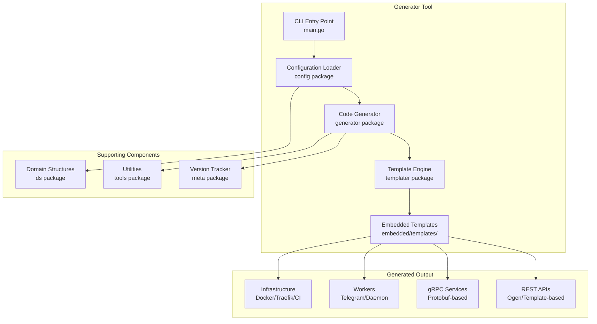
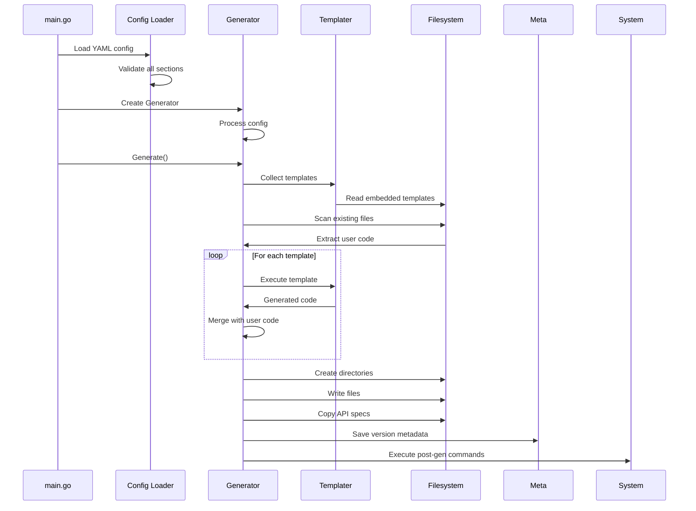

# Go Project Starter - Study Guide

## 🎯 Service Purpose

**This is NOT a running microservice** - it's a **Go microservice project generator/scaffolding tool** that automates the creation of production-ready Go microservices from YAML configuration files.

**Business Problem Solved:** Reduces microservice boilerplate development time from days to minutes while ensuring consistency, best practices, and quality across all generated projects.

**What it generates:**

- REST APIs (OpenAPI/Ogen-based)
- gRPC services (Protocol Buffers-based)
- Background workers (including Telegram bots)
- Kafka consumers
- Complete deployment infrastructure (Docker, CI/CD)

Based on analysis: `cmd/go-project-starter/main.go:30-85`

---

## 📊 Architecture

### Overall Structure



### Pattern Used

**Template-Based Code Generation Architecture** with **Clean Architecture** principles

The generator follows a **hexagonal/clean architecture** pattern:

- **Entry Layer**: CLI flags and main entry point (`cmd/go-project-starter/main.go:30-85`)
- **Configuration Layer**: YAML parsing and validation (`internal/pkg/config/config.go:12-127`)
- **Business Logic Layer**: Code generation orchestration (`internal/pkg/generator/generator.go:396-519`)
- **Template Engine Layer**: Go template execution (`internal/pkg/templater/templater.go:98-410`)
- **Infrastructure Layer**: Embedded filesystem with templates (`internal/pkg/templater/fs.go:15-280`)

**Key Architectural Features:**

- **User Code Preservation**: Intelligently merges generated code with user modifications using disclaimer markers
- **Incremental Generation**: Tracks versions via metadata to support iterative updates
- **Modular Transports**: Pluggable transport layers (REST, gRPC, Kafka, Workers)
- **Driver Injection**: Configurable drivers for databases, caches, external services

### Directory Structure

```
/Users/sklukin/Develop/advix/go-project-starter/
│
├── cmd/                                    # Application entry points
│   └── go-project-starter/
│       └── main.go                         # Main CLI tool (30-85)
│
├── internal/                               # Internal packages
│   └── pkg/
│       ├── config/                         # Configuration management
│       │   ├── config.go                   # Config loader (12-127)
│       │   └── structs.go                  # Config structures (12-412)
│       │
│       ├── generator/                      # Core generation engine
│       │   └── generator.go                # Orchestrator (22-633)
│       │
│       ├── templater/                      # Template processing
│       │   ├── templater.go                # Template executor (98-410)
│       │   ├── fs.go                       # Template filesystem (15-280)
│       │   └── embedded/
│       │       └── templates/
│       │           ├── main/               # Main project templates
│       │           ├── app/                # Application templates
│       │           ├── transport/          # Transport layers
│       │           │   ├── rest/           # REST (Ogen + Template)
│       │           │   ├── grpc/           # gRPC
│       │           │   └── kafka/          # Kafka consumers
│       │           ├── worker/             # Background workers
│       │           └── logger/             # Logger implementations
│       │
│       ├── meta/                           # Version tracking
│       │   └── meta.go                     # Metadata management (15-64)
│       │
│       ├── ds/                             # Domain structures
│       │   └── const.go                    # Core types (1-297)
│       │
│       ├── loggers/                        # Logger abstractions
│       │   ├── loggers.go                  # Interface
│       │   └── zlog.go                     # Zerolog impl (1-67)
│       │
│       └── tools/                          # Utilities
│           └── tools.go                    # File operations
│
├── example/                                # Example configurations
│   ├── config.yaml                         # Example project config (1-121)
│   ├── example.swagger.yml                 # OpenAPI spec (1-223)
│   ├── example.proto                       # gRPC proto (1-41)
│   └── admin.proto                         # Admin service proto (1-17)
│
├── test/                                   # Test files
│   ├── generate_test.go
│   └── configs/                            # Test configurations
│
├── go.mod                                  # Go module (1-56)
├── Makefile                                # Build automation (1-90)
└── README.md                               # Documentation (1-102)
```

**Key Directory Purposes:**

| Directory | Purpose |
|-----------|---------|
| `cmd/` | CLI tool entry point |
| `internal/pkg/config/` | YAML configuration parsing, validation, defaults |
| `internal/pkg/generator/` | Core code generation orchestration |
| `internal/pkg/templater/` | Go template processing and execution |
| `internal/pkg/templater/embedded/` | ~60 embedded template files for microservice generation |
| `internal/pkg/meta/` | Generator version tracking for migrations |
| `internal/pkg/ds/` | Domain types (Transport, App, Driver, Worker) |
| `internal/pkg/loggers/` | Logger interface (supports zerolog) |
| `internal/pkg/tools/` | File operations, git repo management |
| `example/` | Working examples showing all features |

---

## 🔄 Core Business Processes

### Process 1: Project Generation

**What it does:** Orchestrates the entire generation process - collecting templates, preserving user code, generating files, and running post-generation tasks.

**Entry point:** `cmd/go-project-starter/main.go:80-82`
**Core logic:** `internal/pkg/generator/generator.go:396-519`



**Steps:**

1. **Collect Templates** (`generator.go:402-405`): Gathers main, transport, worker, logger, and app templates
2. **Extract User Code** (`generator.go:407-410`): Preserves user modifications below disclaimer markers
3. **Generate Content** (`generator.go:412-422`): Executes templates with configuration parameters
4. **Dry Run Check** (`generator.go:424-454`): Shows what would change without writing files
5. **Create Files** (`generator.go:456-492`): Creates directories, renames old files, writes new files
6. **Copy Specs** (`generator.go:494-496`): Copies OpenAPI/Proto specs to target locations
7. **Save Metadata** (`generator.go:498-500`): Updates meta.yaml with generator version
8. **Post-Generation** (`generator.go:502-516`): Runs git init, tool installation, linting, formatting

### Process 2: Configuration Loading & Validation

**What it does:** Loads YAML configuration, validates all settings, sets defaults, and creates lookup maps for quick access.

**Entry point:** `cmd/go-project-starter/main.go:60-62`
**Core logic:** `internal/pkg/config/config.go:12-127`

**Validation flow:**

1. Parse YAML with Viper (`config.go:18-31`)
2. Validate main settings (`structs.go:189-209`): project name, logger, registry type
3. Validate REST APIs (`structs.go:223-286`): spec paths, generator types, ports
4. Validate gRPC services (`config.go:72-84`): no duplicates
5. Validate drivers (`structs.go:339-357`): import paths, packages
6. Validate applications (`structs.go:376-386`): transport/driver references exist
7. Create lookup maps (`config.go:49-120`)

### Process 3: Template Processing with User Code Preservation

**What it does:** Executes Go templates while preserving user-written code sections marked by disclaimer comments.

**Entry point:** `generator.go:412-422`
**Core logic:** `templater/templater.go:327-374`

**How it works:**

1. **Load Template** (`templater.go:98-119`): Retrieves and caches template from embedded FS
2. **Execute Template** (`templater.go:333-347`): Runs template with parameters
3. **Find User Code** (`templater.go:348-358`): Searches for existing user modifications
4. **Merge Content** (`templater.go:360-372`): Appends user code below generated code

**Disclaimer Marker:**

```go
// If you need you can add your code after this message
```

Location: `templater/disclaimer.go`

**User Code Extraction:** `templater/templater.go:202-307`

- Walks existing directory structure
- Reads each file
- Splits at disclaimer marker
- Stores user code for merging

### Process 4: File Collection

**What it does:** Collects all template files needed based on configuration (REST APIs, gRPC services, workers, applications).

**Entry point:** `generator.go:402`
**Core logic:** `generator.go:521-633`

**Collection strategy:**

- **Main templates** (522): Makefile, Dockerfile, go.mod, CI/CD configs, README
- **Transport templates** (529-562): REST routers/handlers, gRPC servers, Kafka consumers
- **Worker templates** (565-595): Telegram bot, daemon workers
- **Logger templates** (598-604): Zerolog integration
- **Application templates** (606-614): Application-specific code combining transports/drivers

### Process 5: Metadata Version Management

**What it does:** Tracks generator version to enable file migrations and backward compatibility.

**Entry point:** `generator.go:498-500`
**Core logic:** `meta/meta.go:27-64`

**Current version:** 3 (`meta.go:13`)

**Version tracking enables:**

- File renaming during schema migrations (`generator.go:460-478`)
- Backward compatibility checks
- Safe incremental regeneration

---

## 🌐 API Endpoints

### Generated REST Endpoints

The generator creates two types of REST APIs:

#### System Health/Monitoring Endpoints (Template: `sys`)

| Method | Path | Purpose | Handler | File Reference |
|--------|------|---------|---------|----------------|
| GET | `/version` | App version info | `sysController.VersionHandler` | `transport/rest/template/sys/files/handler/sys.go.tmpl:13-18` |
| GET | `/ready` | Readiness probe | `sysController.ReadyHandler` | `transport/rest/template/sys/files/handler/sys.go.tmpl:20-34` |
| GET | `/live` | Liveness probe | `sysController.LiveHandler` | `transport/rest/template/sys/files/handler/sys.go.tmpl:36-44` |
| GET | `/metrics` | Prometheus metrics | `promhttp.HandlerFor` | `transport/rest/template/sys/files/router.go.tmpl:44` |
| GET | `/debug/pprof/*` | Go pprof profiling | `pprof.*` | `transport/rest/template/sys/files/router.go.tmpl:47-55` |

#### Business Logic Endpoints (Ogen-generated from OpenAPI)

Generated from OpenAPI specs using [Ogen](https://github.com/ogen-go/ogen).

**Example endpoints** (from `example/example.swagger.yml:1-223`):

| Method | Path | Purpose | Request | Response |
|--------|------|---------|---------|----------|
| POST | `/item` | Create item | `Item` | `Item` |
| GET | `/items` | List items | None | `Items[]` |
| GET | `/item/{itemId}` | Get item | itemId | `Item` |
| PUT | `/item/{itemId}` | Update item | itemId, `Item` | 200 OK |
| DELETE | `/item/{itemId}` | Delete item | itemId | 200 OK |
| PUT | `/item/{itemId}/like` | Like item | itemId | 201 Created |

**Router location:** `transport/rest/ogen/files/router.go.tmpl:1-83`
**Handler location:** `transport/rest/ogen/files/handler/handler.go.tmpl:1-50`

### Generated gRPC Methods

**Example services** (from `example/example.proto:1-41` and `example/admin.proto:1-17`):

#### ExampleService

| Method | Request | Response | Purpose | Proto Reference |
|--------|---------|----------|---------|-----------------|
| `Get` | `GetRequest` | `GetResponse` | Get single item | `example.proto:8` |
| `List` | `ListRequest` | `ListResponse` | List items | `example.proto:9` |

#### AdminService

| Method | Request | Response | Purpose | Proto Reference |
|--------|---------|----------|---------|-----------------|
| `Restart` | `RestartRequest` | `RestartResponse` | Restart service | `admin.proto:8` |

**Proto generation config:** `transport/grpc/configs/grpc.gen.yaml.tmpl:1-12`

### Generated Telegram Bot Handlers

| Event Type | Handler | Purpose | File Reference |
|------------|---------|---------|----------------|
| PreCheckoutQuery | `PreCheckout` | Payment validation | `worker/template/telegram/files/router.go.tmpl:31-97` |
| SuccessfulPayment | `Purchase` | Payment processing | `worker/template/telegram/files/router.go.tmpl:99-156` |
| CallbackQuery | `CallbackQuery` | Button callbacks | `worker/template/telegram/files/router.go.tmpl:158-218` |
| Message | `TextMessage` | Text/command handling | `worker/template/telegram/files/router.go.tmpl:220-338` |

### Generated Kafka Consumer

**Message structure** (from `example/kafka_example.proto:1-11`):

```protobuf
message ExampleStock {
  string stockId = 1;
  string Name = 2;
  int32 totalCount = 3;
}
```

**Consumer config:** `transport/kafka/configs/kafka.gen.yaml.tmpl:1-7`

---

## 💾 Data Operations

### Databases Used

The generator supports optional database integration:

| Database | Purpose | Connection Setup | Notes |
|----------|---------|------------------|-------|
| **PostgreSQL** | Primary relational DB | Generated via ActiveRecord | Optional, enabled with `use_active_record: true` |
| **Redis** | Caching layer | Generated repository pattern | Optional, configured via repository section |

**Configuration location:** `example/config.yaml:82-90` (commented examples)
**Connection template:** `app/files/.env.example.tmpl:17-21`

### Repository Pattern

**Pattern:** **Driver-Based Architecture** with dependency injection

**Driver Interface:** `ds/const.go:43-47`

```go
type Runnable interface {
    Init(ctx context.Context, serviceName string, rb ServerBucket, metrics *prometheus.Registry) error
    Namable
    OnlyRunnable
}
```

**Service integration:** `main/internal/pkg/service/service.go.tmpl:99-113`

- Drivers injected via constructor
- Type-safe driver discovery using type switches
- Service holds references to all required drivers

**ActiveRecord initialization:** `main/pkg/app/app.go.tmpl:331-339`

### ORM: go-activerecord

**Library:** `github.com/Educentr/go-activerecord/v3`
**Code generator:** `argen` tool

**Workflow:**

1. Define repository declarations in `internal/pkg/model/repository/decl/`
2. Run `make generate-argen` (Makefile.tmpl:260-267)
3. Generated implementations appear in `internal/pkg/model/repository/cmpl/`

**Git exclusion:** Generated files marked with `diff=none` in `.gitattributes`

### Main Data Models

| Model | Purpose | Definition | DB Mapping |
|-------|---------|------------|------------|
| **Actor** | Ephemeral user context | `main/pkg/model/actor/actor.go.tmpl:11-23` | No DB state (read-only) |
| **AuthorizationData** | Auth data transfer | `ds/const.go:65-67` | DTO only |
| **Custom Repositories** | User-defined models | Generated in `repository/` | User-configured via argen |

**Actor Model:**

```go
type Actor struct {
    ID int64
}
```

- Created from authorization data
- No database state
- Read-only interface

---

## 🔗 External Dependencies

### HTTP Clients

| Service Type | Purpose | Client Location | Configuration |
|-------------|---------|-----------------|---------------|
| **Ogen REST Clients** | External API clients | `transport/rest/ogen_client/files/client.go.tmpl:1-51` | OnlineConf: `{service}/transport/rest/{name}/{version}/host` |
| **Generic HTTP** | Base HTTP client | `transport/rest/files/pkg/app/rest/client.go.tmpl:1-42` | Middleware support |
| **Custom Clients** | Third-party APIs | User-defined | OnlineConf paths |

**Ogen REST Client Authentication:**

Generated clients support authentication via `auth_params` configuration:
- **API Key Authentication**: Configured with `transport: header` and `type: apikey`
- API key is read from OnlineConf: `{service}/transport/rest/{rest_pkg_name}/auth_params/apikey`
- Authentication is handled by generated `SecuritySource` struct with `AuthHeader()` method
- API key is passed in request headers automatically for all API calls

### Message Queues

| Type | Purpose | Library | Configuration |
|------|---------|---------|---------------|
| **Kafka** | Event streaming | `github.com/segmentio/kafka-go` | `backend: kafka`, `group`, `topic` in config |

### Key Third-Party Libraries

| Library | Purpose | Version | Usage |
|---------|---------|---------|-------|
| **Educentr OnlineConf** | Dynamic configuration | v0.9.4 | All runtime config |
| **Educentr ActiveRecord** | Database ORM | v1.0.0 | Optional DB access |
| **Ogen** | OpenAPI code generation | Configurable (v0.78.0) | REST API generation |
| **Telegram Bot API** | Telegram integration | `OvyFlash/telegram-bot-api` | Bot workers |
| **Prometheus** | Metrics collection | v1.12.2 | Observability |
| **Zerolog** | Structured logging | v1.27.0 | Logging |
| **Go-Git** | Git operations | v5.11.0 | Repository init |

### Middleware Stack

**Default middleware chain** (in order):

1. **Context Creation** - Request context with timeout
2. **Panic Recovery** - Catches and logs panics
3. **Request Timing** - Tracks request start time
4. **Tracing** - Adds trace IDs (`x-req-id` header)
5. **Metrics** - Prometheus metrics collection
6. **X-Server Header** - Adds server identifier
7. **HTTP Auth** (conditional) - Actor-based authentication
8. **CSRF Protection** (conditional) - Token validation

**Middleware location:** `transport/rest/files/pkg/app/rest/mw/mw.go.tmpl:1-101`

---

## ⚙️ Configuration

### Main Configuration File

**File:** `project.yaml` or `config.yaml`
**Loader:** `internal/pkg/config/config.go:12-127`
**Structures:** `internal/pkg/config/structs.go:12-412`

### Configuration Sections

#### 1. Main Settings (`structs.go:13-23`)

```yaml
main:
  name: myproject
  registry_type: github
  logger: zerolog
  author: "Your Name"
  use_active_record: true
```

#### 2. Git (`structs.go:29-33`)

```yaml
git:
  repo: https://github.com/org/repo
  module_path: github.com/org/repo
```

#### 3. Tools Versions (`structs.go:35-41`)

```yaml
protobuf_version: 1.7.0
golang_version: "1.20"
ogen_version: v0.78.0
golangci_version: 1.55.2
```

#### 4. REST APIs (`structs.go:43-54`)

```yaml
rest:
  - name: example
    path: ./example.swagger.yml
    generator_type: ogen
    port: 8081
    version: v1
    health_check_path: /health
    auth_params:              # Authentication parameters (optional)
      transport: header       # How to send auth data (currently only 'header')
      type: apikey            # Type of authentication (currently only 'apikey')
```

**Generator types:**

- `ogen`: OpenAPI server generation
- `template`: Custom template-based
- `ogen_client`: OpenAPI client generation with optional authentication

**Authentication (`auth_params`):**

For `ogen_client` generator type, you can configure authentication:
- `transport`: How authentication data is sent (`header` - via HTTP headers)
- `type`: Authentication type (`apikey` - API key authentication)
- API keys are read from OnlineConf path: `{service_name}/transport/rest/{rest_name}/auth_params/apikey`
- **Note**: Old `auth_type` in `generator_params` is deprecated - use `auth_params` instead

#### 5. gRPC Services

```yaml
grpc:
  - name: ExampleService
    path: ./example.proto
    port: 8083
```

#### 6. Workers (`structs.go:56-63`)

```yaml
worker:
  - name: telegram
    generator_type: template
    generator_template: telegram
```

#### 7. Drivers (`structs.go:92-98`)

```yaml
driver:
  - name: telegram_bot
    import: pkg/drivers/telegram
    package: telegram
    obj_name: TelegramDriver
    service_injection: "optional custom code"
```

#### 8. Applications (`structs.go:122-128`)

```yaml
application:
  - name: api
    transport:
      rest: [example, sys]
      grpc: [ExampleService]
    driver: [telegram_bot]
    worker: [telegram]
    depends_on_docker_images:
      - ghcr.io/some-app/some-app:latest
```

**Docker Image Dependencies:**

The `depends_on_docker_images` field creates image puller services that ensure required Docker images are pulled before the application starts. Each image in the list generates a dedicated puller service with `pull_policy: always` and the application waits for successful completion. This is useful for applications using Docker-in-Docker or requiring specific images to be available locally.

### Environment Variables

**OnlineConf-based configuration** (`app/files/.env.example.tmpl:1-23`):

```bash
# Core settings
OC_{ProjectName}__devstand=0
OC_{ProjectName}__log__level=info

# REST API settings
OC_{ProjectName}__transport__rest__{name}_{version}__ip=0.0.0.0
OC_{ProjectName}__transport__rest__{name}_{version}__port=8081
OC_{ProjectName}__transport__rest__{name}_{version}__timeout=2s

# Database settings (when ActiveRecord enabled)
OC_{ProjectName}__db__main=127.0.0.1:5432
OC_{ProjectName}__db__main__User=myproject
OC_{ProjectName}__db__main__Password=password
OC_{ProjectName}__db__main__DB=myproject

# Security
OC_{ProjectName}__security__csrf__enabled=0
OC_{ProjectName}__security__httpAuth__enabled=0
```

### Docker Compose

**Infrastructure services:**

- **Traefik**: Reverse proxy with dynamic service discovery
- **OnlineConf Updater**: Configuration synchronization
- **Application containers**: Generated microservices
- **Image Puller Services**: (optional) Pre-pull required Docker images with `depends_on_docker_images`

**Template:** `app/files/docker-compose.yaml.tmpl:1-109`

**Example generated puller service:**
```yaml
cool-app-image-puller:
  image: ghcr.io/some-app/cool-app:latest
  pull_policy: always
  restart: "no"
```

Applications configured with `depends_on_docker_images` will have `depends_on` entries with `condition: service_completed_successfully` for each puller service.

---

## 📁 Additional Materials

This guide is comprehensive. Complex flows are documented inline with sequence diagrams above.

**For deeper understanding:**

- `README.md` - Usage instructions
- `example/config.yaml:1-121` - Complete working example
- `internal/pkg/config/structs.go:189-412` - All validation rules

---

## ⚡ Developer Quick Start

### How to Use This Generator

**1. Install the tool:**

```bash
go install github.com/Educentr/go-project-starter/cmd/go-project-starter@latest
```

**2. Create configuration:**

```bash
mkdir .project-config
# Copy and edit example/config.yaml to .project-config/project.yaml
```

**3. Generate project:**

```bash
go-project-starter --configDir=.project-config --config=project.yaml --target=./my-service
```

**4. Dry-run mode (preview changes):**

```bash
go-project-starter --dry-run --configDir=.project-config --config=project.yaml --target=./my-service
```

### Where to Find What in Generated Projects

- **Entry points** → `cmd/{app-name}/main.go`
- **Business logic** → `internal/pkg/service/`
- **REST handlers** → `pkg/transport/rest/{name}/`
- **gRPC handlers** → `pkg/transport/grpc/{name}/`
- **Data models** → `internal/pkg/model/repository/`
- **Drivers** → `pkg/drivers/{driver-name}/`
- **Configuration** → `OnlineConf` via environment variables
- **API specs** → `specs/openapi/` and `specs/proto/`
- **Docker** → `docker-compose.yaml`

### Key Generator Files for Understanding

1. **`cmd/go-project-starter/main.go:30-85`** - Entry point, shows full generation flow
2. **`internal/pkg/generator/generator.go:396-519`** - Core generation logic
3. **`internal/pkg/config/structs.go:143-166`** - Complete config structure
4. **`internal/pkg/templater/templater.go:327-374`** - Template execution with user code preservation
5. **`example/config.yaml:1-121`** - Working example showing all features

### Understanding the Generator

**Core workflow:**
```
CLI flags → Load config → Validate → Create generator →
Collect templates → Preserve user code → Execute templates →
Write files → Copy specs → Save metadata → Post-generation tasks
```

**Key concepts:**

- **Disclaimer markers**: Separate generated code from user code
- **Incremental generation**: Re-run generator to update project while preserving changes
- **Driver pattern**: All external dependencies (DB, cache, APIs) are drivers
- **Transport agnostic**: Same service can expose REST + gRPC + Workers
- **Configuration-driven**: Everything defined in YAML, no manual coding needed

### Post-Generation Steps

Generated projects include make targets (defined in generated Makefile):

```bash
make git-repo          # Initialize git repository
make install-tools     # Install development tools
make generate          # Run code generators (ogen, argen, mock)
make tidy              # Run go mod tidy
make lint              # Run golangci-lint
make build             # Build application
make test              # Run tests
make docker-build      # Build Docker image
make docker-up         # Start services with docker-compose
```

### Regenerating Projects

**To update an existing project:**

1. Modify `project.yaml` configuration
2. Re-run generator: `go-project-starter --configDir=.project-config --target=./my-service`
3. User code below disclaimer markers is automatically preserved
4. New files/endpoints are added without overwriting manual changes

**Files never regenerated:**

- `.gitignore`
- `go.mod`, `go.sum`
- `LICENSE.txt`
- `README.md`
- `.git/` directory

(Reference: `templater/templater.go:173-200`)

### Important Generator Rules

1. **Every REST API with generator type "ogen" must have a valid OpenAPI spec**
2. **gRPC services require .proto files**
3. **All transports/drivers referenced in applications must be defined**
4. **No duplicate names allowed** (REST, gRPC, drivers are checked)
5. **Registry type must be "github" or "digitalocean"**
6. **Ports must be non-zero for REST APIs (except "sys" template type)**

(Validation: `config/structs.go:189-412`)

---

## 🎓 Key Takeaways

### What This Generator Does

✅ **Automates 90% of microservice boilerplate**
✅ **Enforces best practices** (clean architecture, observability, testing)
✅ **Generates production-ready code** (Docker, CI/CD, monitoring)
✅ **Supports multiple transport types** (REST, gRPC, Kafka, Workers)
✅ **Preserves user modifications** (intelligent code merging)
✅ **Enables rapid iteration** (re-run to update existing projects)

### Generated Project Features

- **Clean Architecture**: Clear separation of concerns
- **OpenAPI-First**: REST APIs generated from specs
- **gRPC Support**: Full Protocol Buffers integration
- **Background Workers**: Telegram bots, daemons, Kafka consumers
- **Observability**: Prometheus metrics, tracing, structured logging
- **Configuration Management**: Dynamic config via OnlineConf
- **Database Access**: Optional ActiveRecord ORM
- **Docker Ready**: Complete docker-compose setup with Traefik
- **CI/CD**: GitHub Actions workflows
- **Code Quality**: golangci-lint, pre-commit hooks
- **Testing**: Test structure and mock generation

### Architecture Principles

1. **Hexagonal Architecture**: Core business logic isolated from transport/infrastructure
2. **Dependency Injection**: Drivers injected into services
3. **Configuration-Driven**: All behavior controlled via YAML + OnlineConf
4. **Code Generation**: Reduce manual work, increase consistency
5. **Incremental Updates**: Safe to regenerate without losing work
6. **Transport Agnostic**: Same service logic exposed via multiple transports

---

**Generated with** `go-project-starter` v3 on 2025-09-30